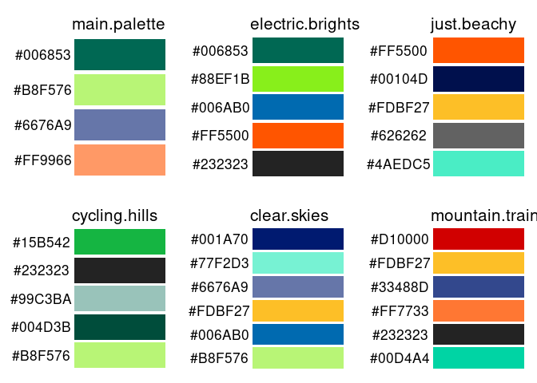
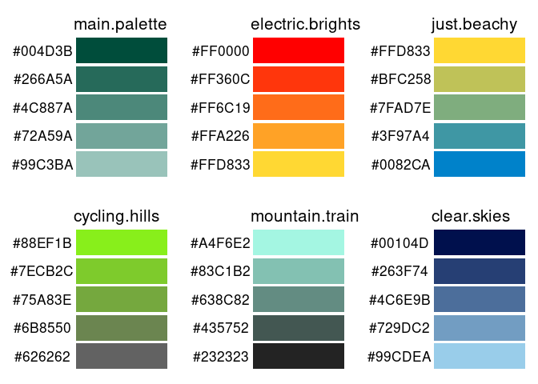
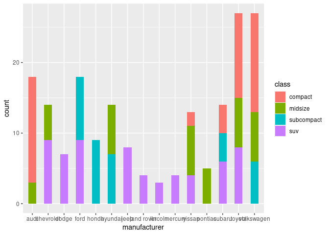
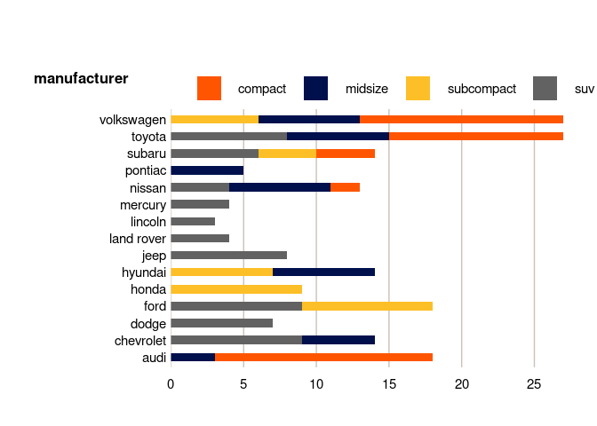

# dftplotR

dftplotR is an R package to provide standardised charts formatting in
ggplot2. It includes theme functions which meet Government Statistical
Service (GSS) best practice guidance. It also includes colour palettes
based on DfT corporate branding which meet WCAG 2.0 accessibility
standards, and are distinguishable in greyscale.

## Installation

The package can be installed directly from Github using the remotes
`install_github` call

    install.packages("remotes")
    remotes::install_github("department-for-transport/dftplotr")

## Overview

The package contains the following functions:

`scale_colour_dft`: ggplot function which applies one of a range of DfT
palettes to a ggplot line chart (or other chart which groups by
**colour**)

`scale_fill_dft`: ggplot function which applies one of a range of DfT
palettes to a ggplot line chart (or other chart which groups by
**fill**)

`display_palette`: a visual output which shows all of the colours
contained in the selected DfT palette

`theme_general_dft`; ggplot function which applies a standardised theme
to all ggplot charts.

`theme_bar_dft`; ggplot function which applies a standardised theme to
ggplot bar chart. There are options to pick other dft color palettes and
top flip the x and y axis. This theme also sets the x-axis intercept at
y to 0.

`theme_line_dft`; ggplot function which applies a standardised theme to
a ggplot line chart. There are options to pick other dft color palettes.
This theme also sets the x-axis intercept at y to 0.

## Colour palettes

The dftplotR package comes with 6 pre-loaded palettes. These contain
colours taken from the DfT corporate colour scheme, and have also been
selected to meet accessibility guidance. The two primary palettes are
`main.palette`; a desaturated palette ideal for use in bar charts or
other area fill charts, and `electric.brights`, a saturated palette
which improves visibility in line-charts or other point colour charts.
The other palettes are ideal where these palettes are not appropriate,
or where variation is needed.

The palettes and the colours in them can be seen here, or visualised
within the package by calling `display.palette()` and the palette name.

## Gradient palettes

The dftplotR package also comes with 6 gradient palettes. These have
defined start and end colours taken from the DfT corporate colour
scheme, and will auto-generate shades between these two points to create
the specified number of colours. These do not meet accessibility
guidance, and should only be used when the pre-set palettes are not
appropriate and colour is not conveying the primary message of the
visualisation.

The palettes and the colours in them can be seen here, or visualised
within the package by calling `display.palette(gradient = TRUE)` and the
palette name. The number of shades in the palette can be specified using
the `n =` argument, e.g. `n = 8` for a palette with 8 shades. When this
argument is not used, the default number of shades is 5. Example
gradient palettes with 5 shades can be seen below:

## ggplot2 themes

The dftplotR package comes with three standard themes to apply to
charts.

The `theme_general_dft` theme can be applied to any ggplot chart type
and is used as a base for the other two more specific themes.

The `theme_bar_dft` theme work best with bar charts. It gives the
flexibility of customising the final plot with options for changing the
colour palette, moving the legend position and flipping the x and y-axis
around when x-axis labels are too long. It also sets the intercept of
the x-axis with the y-axis to 0.

The `theme_line_dft` theme works best with line charts. It gives he
flexibility of customising the final plot with options for changing the
colour paletter. It also labels lines with the label name and sets the
intercept of the x-axis with the y-axis to 0.

The difference between a bar plot without themeing and one with the
`theme_bar_dft` theme can be seen below:

## Palette picker tool

The palette picker tool is a Shiny tool which is now [available directly
here](https://rstudio-connect/palette_picker/) instead of bundled into the package. This tool allows
visualisation of all DfT corporate colours in two chart formats; line
and bar, to allow you to build and visualise your own custom palettes.

It contains options to allow you to select a WCAG 2.0 accessibility
rating you require the palette to meet, and functions to show what that
palette looks like in grayscale and with the most common forms of
colour-blindness.

This tool is ideal to facilitate building your own palettes for use in
applications outside of statistical publications, while still conforming
to the DfT corporate colours and GSS accessibility guidance.

## Accessibility

The dftplotr colour palettes aim to be accessible to those with the most
common forms of colour blindness, and should also be discernable in
greyscale. The standard palettes in this package have been designed to
meet WCAG 2.0 accessibility guidance.

Four of the created palettes (`main.palette`, `electric.brights`,
`just.beachy` and `cycling.hills`) contain four colours each, and meet
WCAG 2.0 AAA guidance. All colours have a contrast ratio of at least
4.5:1 to the bars adjacent to them, and alternate light and dark shades
to further increase contrast. This is the highest standard of
accessibility and should be used when possible.

Two of the created palettes (`mountain.train` and `clear.skies`) contain
6 colours each, and meet WCAG 2.0 AA guidance. All colours have a
contrast ration of at least 3:1 to the bars adjacent to them, and
alternate light and dark shades to further increase contrast. This is
the minimum standard of accessibility required for publication and use
should be limited to times when a larger palette is required.

It is also possible to generate gradient palettes using this package,
with colours based on the DfT corporate theme. While these palettes can
be generated with any number of shades, there is no guarantee that the
contrast between these colours is sufficient to meet accessibility
standards. These palettes should only be used in very limited
circumstances where colour is not the only means of distinguishing
different groupings and none of the standard palettes are suitable.

For line charts, it may be possible that lines with reduced contrast are
next to each other. As a result, and in line with GSS recommendation,
line charts should be labelled directly where possible rather than using
a legend.
